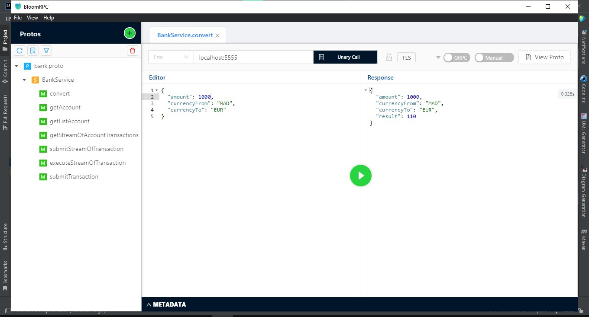
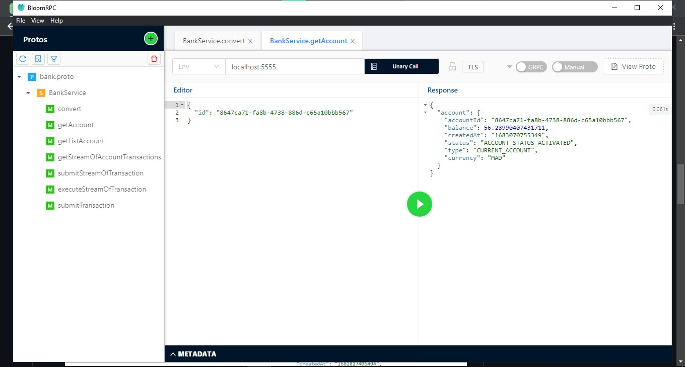
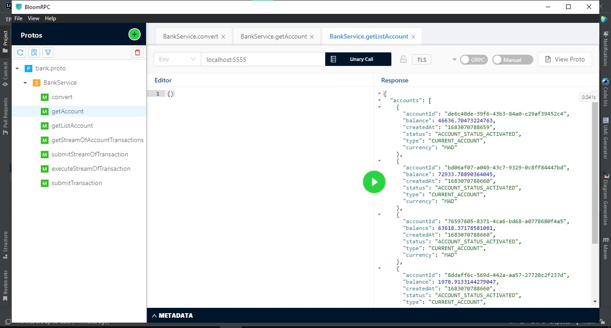
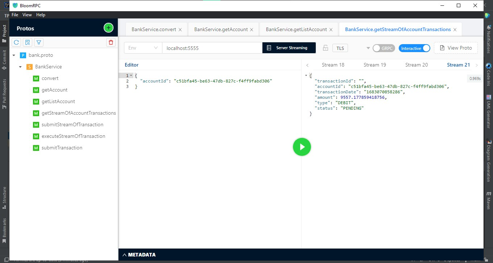
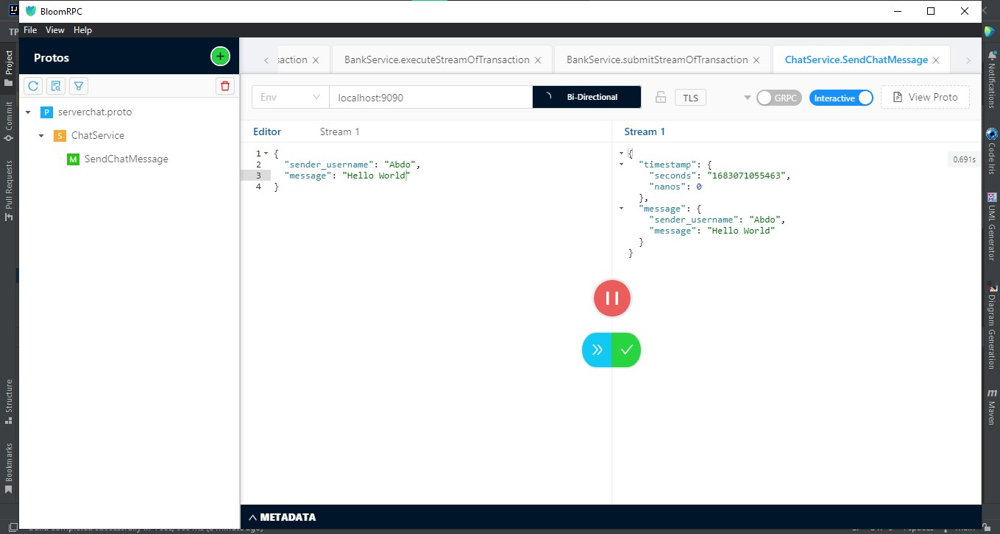
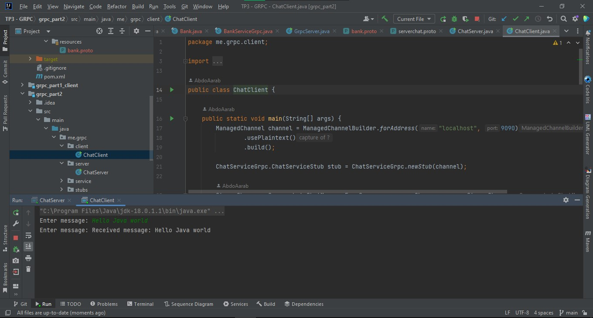
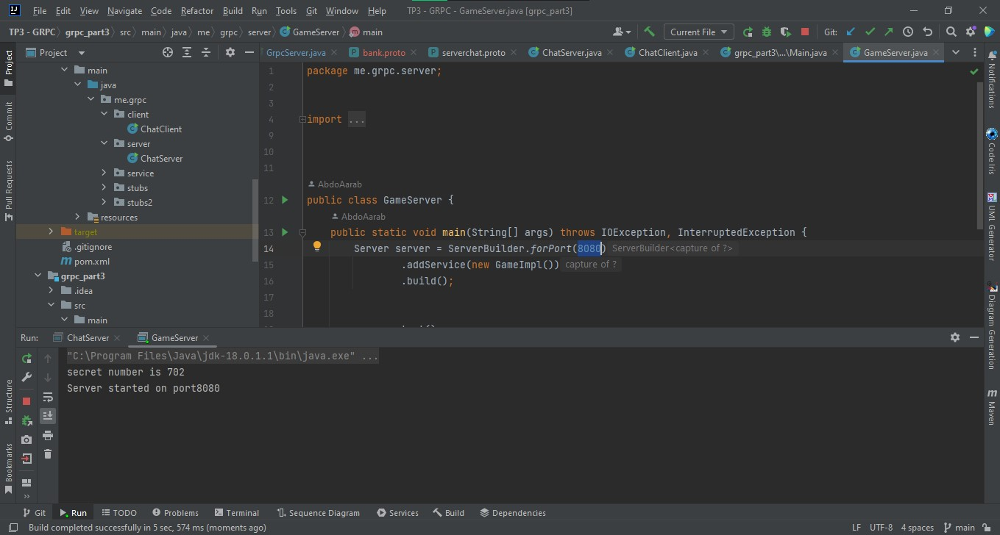
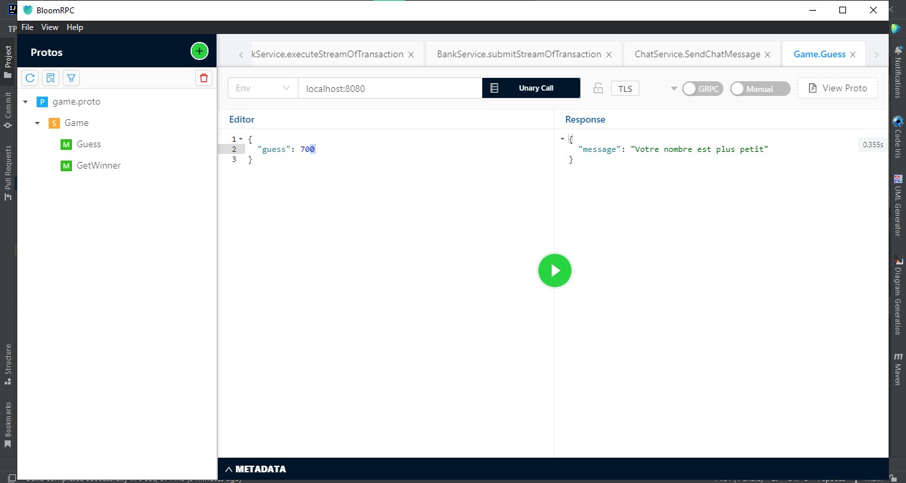
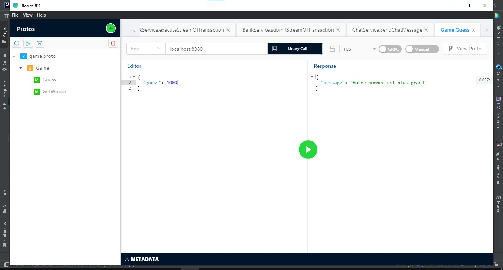
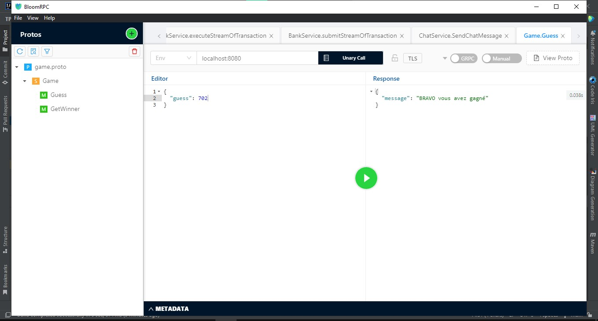

# TP3 - GRPC

## Part 1

* covert currency method:
      
* getAccount method:
    
* getListAccount method:
    
* getStreamOfAccountTransactions method:
    

## Part 2

* Using BloomRPC :
        

* Using java client :  

    

## Part 3

* game server :
    

* Try 1: 
    
* Try 2:  
    
* Try 3:  
    
